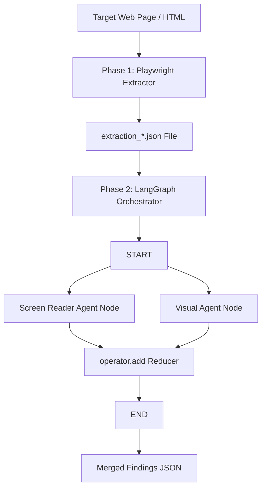
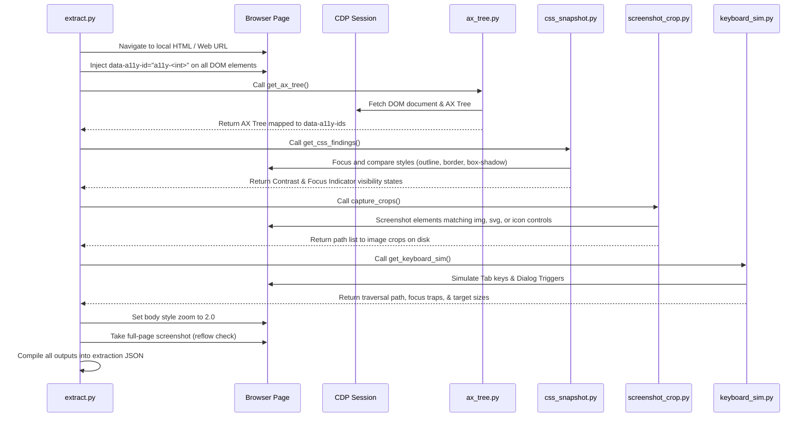

# A11yAgents Project Architecture & Algorithm

This document outlines the entire structure, execution sequence, data flows, and algorithms utilized across the project. It describes how the Playwright extraction pipeline works, how data is represented, and how agents execute in parallel using LangGraph.

---

## 1. High-Level Architecture Overview

The project is structured as a two-phase accessibility auditing pipeline:



1. **Phase 1 (Extraction)**: Runs a Playwright Chromium session, injects unique IDs (`data-a11y-id`), and queries DOM properties and CDP AX trees.
2. **Phase 2 (Auditing)**: Loads the extraction output and passes it into a compiled LangGraph workflow. Multiple agents execute in parallel, audit the data (calling the Gemini API where needed), and merge findings.

---

## 2. Phase 1: Playwright Extraction Algorithm

The extraction phase is managed by `extractor/extract.py`. When run, it executes the following sequential steps:



### Extractor Modules

*   **`ax_tree.py`**:
    *   *CDP Connection*: Opens a Chrome DevTools Protocol session to fetch the DOM document (`DOM.getDocument`) and AX Tree (`Accessibility.getFullAXTree`).
    *   *Algorithm*: Maps CDP `backendDOMNodeId` to `data-a11y-id` by walking the DOM node attributes, then constructs a clean node list of roles, names, descriptions, and state states (e.g. `disabled`, `checked`, `expanded`).
*   **`css_snapshot.py`**:
    *   *Text Contrast*: Walks DOM text nodes, computes their background (walking up ancestors if transparent) and foreground colors, and calculates the mathematical relative luminance contrast ratio.
    *   *Focus Indicators*: Locates all focusable elements, reads their computed style, calls `.focus()` in-browser, reads the style again, and diffs them (checking `outline`, `border`, `box-shadow`) to detect missing focus indicators.
*   **`keyboard_sim.py`**:
    *   *Tab Traversal*: Dispatches tab events up to 100 times, recording `document.activeElement`'s identifier until focus returns to the body or a loop is detected.
    *   *Unreachable*: Flags focusable elements that never received focus.
    *   *Illogical Jumps*: Detects if focus moves backwards in DOM order indices.
    *   *Focus Traps*: Activates dialog triggers and checks if Tab key gets stuck, or if pressing Escape fails to restore focus to the trigger.
    *   *Target Size*: Queries elements to see if bounding boxes are smaller than 24x24px.
*   **`screenshot_crop.py`**:
    *   Locates images, SVGs, and icon-only buttons. Takes element-specific screenshots and saves them under `test_pages/_artifacts/crops/`.

---

## 3. Phase 2: LangGraph Orchestration & Concurrency

Orchestration is managed by a stateful multi-actor graph in `agents/agent_graph.py`.

### 1. State Definition
The graph passes an `AgentState` object through its nodes:
```python
class AgentState(TypedDict):
    extraction: dict[str, Any]
    findings: Annotated[list[dict[str, Any]], operator.add]
```
*   **`extraction`**: The static extraction data input.
*   **`findings`**: A list of reported issues. Annotated with `operator.add`, meaning when nodes return a list of findings, LangGraph automatically concatenates them together rather than overwriting.

### 2. Node Execution & Parallelism
The graph contains two parallel auditing nodes:

1.  **`screen_reader_node`**:
    *   Takes the accessibility tree (`ax_tree`) and image crops (`image_crops`) from `AgentState["extraction"]`.
    *   Batches image crops (10 at a time) and sends base64 crops to the Gemini API, asking if the alt text is present and meaningful.
    *   Audits heading hierarchy (e.g., skipping from H1 to H4), unlabeled controls, and meaningless link text (e.g., "click here") via text-only prompts.
    *   Returns findings with `agent: "screen_reader"`.
2.  **`visual_node`**:
    *   Takes the contrast ratios and focus ring boolean metrics (`css_findings`) and the 200% zoom screenshot (`zoom_screenshot_path`) from `AgentState["extraction"]`.
    *   Deterministically filters out elements failing the WCAG contrast threshold (4.5:1 normal / 3:1 large text) or focus ring visibility.
    *   Sends these candidates to the Gemini API to format severity levels and write descriptions with actual ratios.
    *   Sends the full page screenshot to check for visual overlaps or text clipping under zoom.
    *   Returns findings with `agent: "visual"`.

### 3. Execution Flow Control
```
         START
           │
     ┌─────┴─────┐
     ▼           ▼
[screen_reader] [visual]   (Executed in Parallel)
     │           │
     └─────┬─────┘
           ▼
        [ Merge ]          (Concatenated via operator.add reducer)
           │
           ▼
          END
```

*   **Concurrency**: The graph executes `screen_reader` and `visual` nodes asynchronously/concurrently since both have `START` as their predecessor and `END` as their successor.
*   **Error Tolerance**: If a node fails (e.g., due to network issues or API key validation errors), the exception is caught, empty list `[]` is returned, and the graph safely proceeds.

---

## 4. Schema Specifications

### `extraction.schema.json`
Output of Phase 1 and input to Phase 2:
*   `page`: Target page path/URL.
*   `ax_tree`: `[ { element_ref, role, name, description, states } ]`
*   `css_findings`: `[ { element_ref, contrast_ratio, is_large_text, focus_indicator_visible } ]`
*   `keyboard_sim`: `[ traversal_order, unreachable, illogical_jumps, trap_issues, small_targets ]`
*   `image_crops`: `[ { element_ref, crop_path, claimed_alt } ]`
*   `zoom_screenshot_path`: Screenshot path.

### `finding.schema.json`
Output format of the individual agents and the merged LangGraph list:
*   `finding_id`: Unique UUID.
*   `element_ref`: The matched `"a11y-<int>"` identifier.
*   `agent`: `"screen_reader"` or `"visual"`.
*   `issue_type`: Category identifier (e.g., `missing_alt`, `low_contrast`).
*   `wcag_criterion`: Valid criteria ID (e.g., `"1.1.1"`).
*   `severity`: `"critical" | "serious" | "moderate" | "minor"`.
*   `evidence`: Observed facts.
*   `confidence`: Decimal `0` to `1`.
